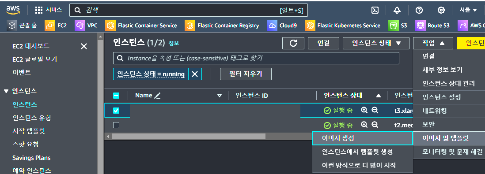

# EC2 Setup RHEL7.9
~~~
- RHEL 7.9 기준으로 EC2 인스턴스를 생성하고 개발 환경 및 AWS 서비스를 사용하기 위해 설정하고 AMI를 생성하는 과정을 정리한 내용입니다.
- 모든 과정을 진행할 필요 없으며 내용 확인 후 필요한 부분만 진행하세요.
- EC2 인스턴스 정보
  Instance type : t3.xlarge
  Disk Info : Size(300GB), Type(gp3), IOPS(10000), Throughput(1000)
  AMI : RHEL-7.9_HVM-20221027-x86_64-0-Access2-GP2,
        RHEL-8.9.0_HVM-20231101-x86_64-11-Access2-GP3
~~~
<br>

## root 계정 비밀번호 설정
```shell
$ sudo passwd root
root 사용자의 비밀 번호 변경 중
새  암호:
새  암호 재입력:
```
<br>

## TIMEZONE 확인 및 변경
```shell
$ timedatectl set-timezone Asia/Seoul
```
<br>

## 계정 추가
```shell
$ useradd -d "홈 디렉토리" -s /bin/bash "계정명"
```
<br>

## 필요 패키지 설치
```shell
$ yum -y install wget gcc gcc-c++ sysstat strace vim

# NATS.io
$ yum -y install git openssl-devel bzip2-devel

# docker
$ yum -y install yum-utils

# AWS CLI
$ yum -y install less unzip jq

# 한 줄
$ yum -y install wget gcc gcc-c++ sysstat strace vim git openssl-devel bzip2-devel yum-utils less unzip jq
```
<br>

## AWS CLI 설치
- https://docs.aws.amazon.com/ko_kr/cli/latest/userguide/getting-started-install.html
- ec2-user 계정에서 작업
```shell
$ curl "https://awscli.amazonaws.com/awscli-exe-linux-x86_64.zip" -o "awscliv2.zip"
$ unzip awscliv2.zip; cd aws
$ ./install
$ which aws
$ aws --version
```
<br>

## AWS ECS Agent 설치
- https://repost.aws/questions/QUgn5lMAy3Qfye0cQAVPoLjg/rhel-9-를-ecs에서-사용할-수-있는-방법이-있을까요
- https://aws.amazon.com/ko/premiumsupport/knowledge-center/ecs-create-custom-AMIs
- ec2-user 계정에서 작업
```shell
# ECS Agent 다운로드
$ curl -o amazon-ecs-init.rpm https://s3.ap-northeast-2.amazonaws.com/amazon-ecs-agent-ap-northeast-2/amazon-ecs-init-latest.x86_64.rpm
# ECS Agent 설치
$ yum install -y ./amazon-ecs-init.rpm
# ECS Agent enable 및 구동
$ systemctl enable --now ecs
```
<br>

## lz4-devel 설치
- 해당 OS 이미지의 yum 저장소에서 찾지 못하여 직접 설치
- ec2-user 계정에서 작업
```shell
# 7.9
$ wget https://rpmfind.net/linux/centos/7.9.2009/os/x86_64/Packages/lz4-devel-1.8.3-1.el7.x86_64.rpm
$ rpm -i lz4-devel-1.8.3-1.el7.x86_64.rpm
```
```shell
# 8.9
 yum -y install lz4-devel
```
<br>

## CMAKE 수동 업데이트
- ec2-user 계정에서 작업
```shell
# 7.9
$ wget https://github.com/Kitware/CMake/releases/download/v2.26.4/cmake-3.26.4.tar.gz
$ tar -zxvf cmake-3.26.5.tar.gz
$ cd cmake-3.26.5
$ ./bootstrap
$ gmakemake
$ make install
```
```shell
# 8.9
yum -y install cmake
```
<br>

## NATS.io 서버 및 C클라이언트 컴파일 및 설치
- ec2-user 계정에서 작업
- NATS.io 서버 설치
```shell
# RPM 다운로드 및 설치
$ wget https://github.com/nats-io/nats-server/releases/download/v2.10.7/nats-server-v2.10.7-amd64.rpm
$ rpm -i nats-server-v2.10.7-amd64.rpm
# 위치 확인
$ which nats-server
/usr/local/bin/nats-server
```
- NATS.io C 클라이언트 설치
```shell
$ git clone https://github.com/nats-io/nats.c.git
$ cd nats.c
$ mkdir build; cd build
# cmake 컴파일 옵션은 README에서 확인 필요
# RHEL-7.9
$ cmake .. -DNATS_BUILD_WITH_TLS=OFF -DNATS_BUILD_STREAMING=OFF
# RHEL-8.9
$ make install
```
<br>

## docker 설치
- https://docs.docker.com/engine/install/centos/
- ec2-user 계정에서 작업
```shell
# add repo
$ yum-config-manager --add-repo https://download.docker.com/linux/centos/docker-ce.repo
$ vi /etc/yum.repos.d/docker-ce.repo
```shell
# RHEL-7.9 - docker-ce.repo 파일에 아래 내용 추가 후 저장 (install 오류로 추가)
[centos-extras]
name=Centos extras - $basearch
baseurl=http://mirror.centos.org/centos/7/extras/x86_64
enabled=1
gpgcheck=1
gpgkey=http://centos.org/keys/RPM-GPG-KEY-CentOS-7
```
```shell
# install docker
$ yum install docker-ce docker-ce-cli containerd.io docker-buildx-plugin docker-compose-plugin

# docker start & reboot auto start
$ systemctl start docker
$ systemctl enable docker

# docker 그룹 생성 및 일반 계정 그룹 추가
$ usermod -aG docker $USER
$ groups $USER

# docker version check
$ docker version
```
<br>

## 인스턴스 스토리지 사용하는 경우
- https://docs.aws.amazon.com/ko_kr/AWSEC2/latest/UserGuide/add-instance-store-volumes.html
- 인스턴스 시작시 생성, 종료시 같이 삭제
- 해당 내용을 템플릿 하단에 "고급세부정보"에 추가
```shell
$ sudo mkfs -t xfs /dev/nvme1n1
$ sudo mkdir /data
$ sudo mount /dev/nvme1n1 /data
```
<br>

## EC2 이미지 생성 (AMI:Amazon Machine Image)
- 필요에 따라 서비스 중지
```shell
$ sudo systemctl stop ecs
$ sudo systemctl disable docker.socket
$ sudo systemctl stop docker.socket
$ sudo systemctl stop docker.service
```
- ECS 클러스터에서 이용하기 위해 AMI를 생성하기 전 불필요한 파일들을 제거를 위한 shell 생성 (cleanup.sh)
```shell
$ vi cleanup.sh

# 이미지 생성전 불필요한 파일 정리를 위해 내용 추가
#!/bin/bash
if [[ ! -f {{workingDirectory}}/perform_cleanup ]]; then
    echo "Skipping cleanup"
    exit 0
else
    sudo rm -f {{workingDirectory}}/perform_cleanup
fi

function cleanup() {
    FILES=("$@")
    for FILE in "${FILES[@]}"; do
        if [[ -f "$FILE" ]]; then
            echo "Deleting $FILE";
            sudo shred -zuf $FILE;
        fi;
        if [[ -f $FILE ]]; then
            echo "Failed to delete '$FILE'. Failing."
            exit 1
        fi;
    done
};

# Clean up for cloud-init files
CLOUD_INIT_FILES=(
    "/etc/sudoers.d/90-cloud-init-users"
    "/etc/locale.conf"
    "/var/log/cloud-init.log"
    "/var/log/cloud-init-output.log"
)
if [[ -f {{workingDirectory}}/skip_cleanup_cloudinit_files ]]; then
    echo "Skipping cleanup of cloud init files"
else
    echo "Cleaning up cloud init files"
    cleanup "${CLOUD_INIT_FILES[@]}"
    if [[ $( sudo find /var/lib/cloud -type f | sudo wc -l ) -gt 0 ]]; then
        echo "Deleting files within /var/lib/cloud/*"
        sudo find /var/lib/cloud -type f -exec shred -zuf {} \;
    fi;

    if [[ $( sudo ls /var/lib/cloud | sudo wc -l ) -gt 0 ]]; then
        echo "Deleting /var/lib/cloud/*"
        sudo rm -rf /var/lib/cloud/* || true
    fi;
fi;

# Clean up for temporary instance files
INSTANCE_FILES=(
    "/etc/.updated"
    "/etc/aliases.db"
    "/etc/hostname"
    "/var/lib/misc/postfix.aliasesdb-stamp"
    "/var/lib/postfix/master.lock"
    "/var/spool/postfix/pid/master.pid"
    "/var/.updated"
    "/var/cache/yum/x86_64/2/.gpgkeyschecked.yum"
)
if [[ -f {{workingDirectory}}/skip_cleanup_instance_files ]]; then
    echo "Skipping cleanup of instance files"
else
    echo "Cleaning up instance files"
    cleanup "${INSTANCE_FILES[@]}"
fi;

# Clean up for ssh files
SSH_FILES=(
    "/etc/ssh/ssh_host_rsa_key"
    "/etc/ssh/ssh_host_rsa_key.pub"
    "/etc/ssh/ssh_host_ecdsa_key"
    "/etc/ssh/ssh_host_ecdsa_key.pub"
    "/etc/ssh/ssh_host_ed25519_key"
    "/etc/ssh/ssh_host_ed25519_key.pub"
    "/root/.ssh/authorized_keys"
)
if [[ -f {{workingDirectory}}/skip_cleanup_ssh_files ]]; then
    echo "Skipping cleanup of ssh files"
else
    echo "Cleaning up ssh files"
    cleanup "${SSH_FILES[@]}"
    USERS=$(ls /home/)
    for user in $USERS; do
        echo Deleting /home/"$user"/.ssh/authorized_keys;
        sudo find /home/"$user"/.ssh/authorized_keys -type f -exec shred -zuf {} \;
    done
    for user in $USERS; do
        if [[ -f /home/"$user"/.ssh/authorized_keys ]]; then
            echo Failed to delete /home/"$user"/.ssh/authorized_keys;
            exit 1
        fi;
    done;
fi;


# Clean up for instance log files
INSTANCE_LOG_FILES=(
    "/var/log/audit/audit.log"
    "/var/log/boot.log"
    "/var/log/dmesg"
    "/var/log/cron"
)
if [[ -f {{workingDirectory}}/skip_cleanup_instance_log_files ]]; then
    echo "Skipping cleanup of instance log files"
else
    echo "Cleaning up instance log files"
    cleanup "${INSTANCE_LOG_FILES[@]}"
fi;

# Clean up for TOE files
if [[ -f {{workingDirectory}}/skip_cleanup_toe_files ]]; then
    echo "Skipping cleanup of TOE files"
else
    echo "Cleaning TOE files"
    if [[ $( sudo find {{workingDirectory}}/TOE_* -type f | sudo wc -l) -gt 0 ]]; then
        echo "Deleting files within {{workingDirectory}}/TOE_*"
        sudo find {{workingDirectory}}/TOE_* -type f -exec shred -zuf {} \;
    fi
    if [[ $( sudo find {{workingDirectory}}/TOE_* -type f | sudo wc -l) -gt 0 ]]; then
        echo "Failed to delete {{workingDirectory}}/TOE_*"
        exit 1
    fi
    if [[ $( sudo find {{workingDirectory}}/TOE_* -type d | sudo wc -l) -gt 0 ]]; then
        echo "Deleting {{workingDirectory}}/TOE_*"
        sudo rm -rf {{workingDirectory}}/TOE_*
    fi
    if [[ $( sudo find {{workingDirectory}}/TOE_* -type d | sudo wc -l) -gt 0 ]]; then
        echo "Failed to delete {{workingDirectory}}/TOE_*"
        exit 1
    fi
fi

# Clean up for ssm log files
if [[ -f {{workingDirectory}}/skip_cleanup_ssm_log_files ]]; then
    echo "Skipping cleanup of ssm log files"
else
    echo "Cleaning up ssm log files"
    if [[ $( sudo find /var/log/amazon/ssm -type f | sudo wc -l) -gt 0 ]]; then
        echo "Deleting files within /var/log/amazon/ssm/*"
        sudo find /var/log/amazon/ssm -type f -exec shred -zuf {} \;
    fi
    if [[ $( sudo find /var/log/amazon/ssm -type f | sudo wc -l) -gt 0 ]]; then
        echo "Failed to delete /var/log/amazon/ssm"
        exit 1
    fi
    if [[ -d "/var/log/amazon/ssm" ]]; then
        echo "Deleting /var/log/amazon/ssm/*"
        sudo rm -rf /var/log/amazon/ssm
    fi
    if [[ -d "/var/log/amazon/ssm" ]]; then
        echo "Failed to delete /var/log/amazon/ssm"
        exit 1
    fi
fi


if [[ $( sudo find /var/log/sa/sa* -type f | sudo wc -l ) -gt 0 ]]; then
    echo "Deleting /var/log/sa/sa*"
    sudo shred -zuf /var/log/sa/sa*
fi
if [[ $( sudo find /var/log/sa/sa* -type f | sudo wc -l ) -gt 0 ]]; then
    echo "Failed to delete /var/log/sa/sa*"
    exit 1
fi

if [[ $( sudo find /var/lib/dhclient/dhclient*.lease -type f | sudo wc -l ) -gt 0 ]]; then
        echo "Deleting /var/lib/dhclient/dhclient*.lease"
        sudo shred -zuf /var/lib/dhclient/dhclient*.lease
fi
if [[ $( sudo find /var/lib/dhclient/dhclient*.lease -type f | sudo wc -l ) -gt 0 ]]; then
        echo "Failed to delete /var/lib/dhclient/dhclient*.lease"
        exit 1
fi

if [[ $( sudo find /var/tmp -type f | sudo wc -l) -gt 0 ]]; then
        echo "Deleting files within /var/tmp/*"
        sudo find /var/tmp -type f -exec shred -zuf {} \;
fi
if [[ $( sudo find /var/tmp -type f | sudo wc -l) -gt 0 ]]; then
        echo "Failed to delete /var/tmp"
        exit 1
fi
if [[ $( sudo ls /var/tmp | sudo wc -l ) -gt 0 ]]; then
        echo "Deleting /var/tmp/*"
        sudo rm -rf /var/tmp/*
fi

# Shredding is not guaranteed to work well on rolling logs

if [[ -f "/var/lib/rsyslog/imjournal.state" ]]; then
        echo "Deleting /var/lib/rsyslog/imjournal.state"
        sudo shred -zuf /var/lib/rsyslog/imjournal.state
        sudo rm -f /var/lib/rsyslog/imjournal.state
fi

if [[ $( sudo ls /var/log/journal/ | sudo wc -l ) -gt 0 ]]; then
        echo "Deleting /var/log/journal/*"
        sudo find /var/log/journal/ -type f -exec shred -zuf {} \;
        sudo rm -rf /var/log/journal/*
fi

sudo touch /etc/machine-id
```
- cleanup.sh 실행
```shell
$ chmod 755 cleanup.sh
$ ./cleanup.sh
$ rm cleanup.sh
```
- ECS 관련 로그 삭제
```shell
$ rm -rf /var/log/ecs/*
$ rm /var/lib/ecs/data/agent.db
```
- EC2 대쉬보드에서 Instances(인스턴스) -> EC2 선택(체크 박스) -> Ations(작업) -> Image And templates(이미지 및 템플릿) -> Create image(이미지 생성)


<br>
