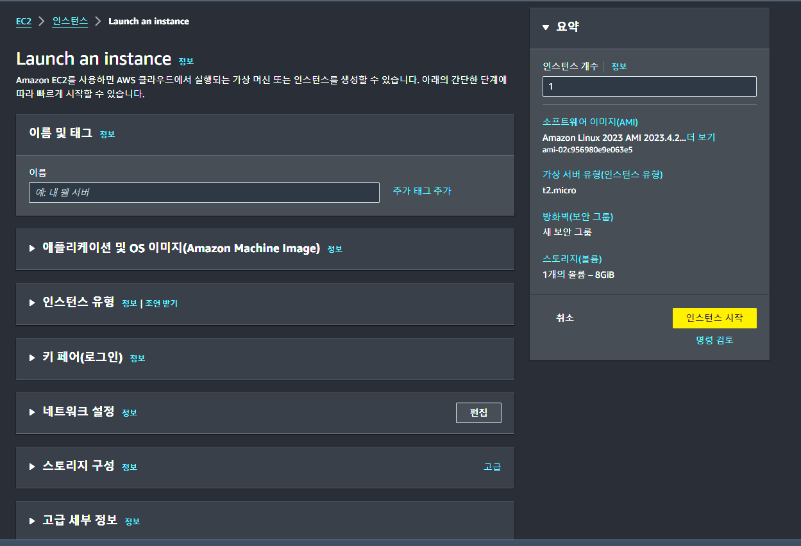
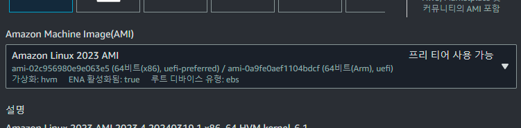
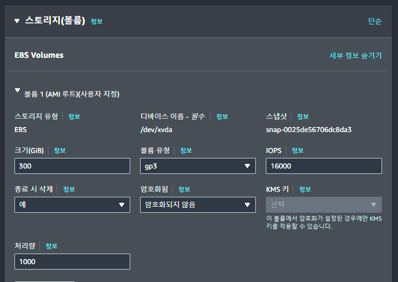
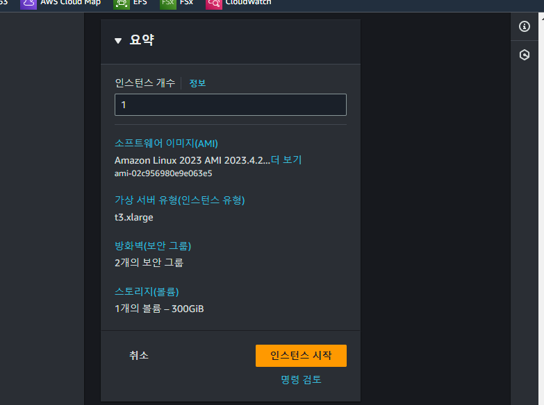
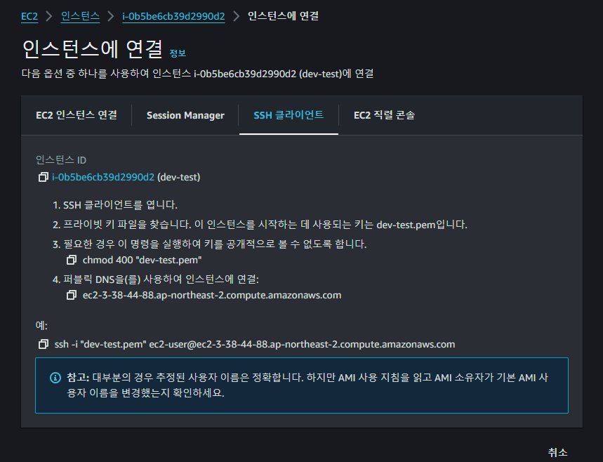

# EC2-Instance-Start
- AWS EC2 인스턴스를 생성하고 설정하는 과정을 정리합니다.

<br>

## Table of Contents
- [기타 확인 사항](#기타-확인-사항)

- [인스턴스 생성](#인스턴스-생성)

- [인스턴스 시작 및 접속](#인스턴스-시작-및-접속)

- [인스턴스 스토리지를 사용하는 경우](#인스턴스-스토리지를-사용하는-경우)
<br>

## 기타 확인 사항
- 인스턴스 유형의 명칭은 인스턴스 유형, 세대, 프로세서, 추가기능, 크기 순서입니다.

- 1vCPU = 1스레드, 코어당 스레드는 인스턴스 유형마다 다릅니다.

- t3.large 유형 기준 버스트 모드의 효율이 좋지 못하면 지속적으로 성능을 제공하는 m5.large가 더 좋은 선택일 수 있습니다.<br>(LINUX, RHEL 시간당 요금 기준, m5.large 유형이 네트워크 대역폭이 2배 더 큼)

<br>

## 인스턴스 생성
- EC2 서비스에서 "인스턴스 시작(Launch instance)"을 누르면 설정 화면으로 이동합니다.
<br>

  
</br>

### 애플리케이션 및 OS 이미지
- 이미 생성한 AMI나 인증 업체에서 제공하는 OS 이미지, 아키텍처 유형을 선택합니다.
<br>

  
</br>

### 인스턴스 유형
- 적절한 인스턴스 유형 선택 합니다. 개발 및 테스트, AMI 생성을 위한 설정 용도로 t3 유형을 선택합니다. ([인스턴스 유형 정보](https://docs.aws.amazon.com/ko_kr/AWSEC2/latest/UserGuide/instance-types.html))
<br>

  
</br>

### 키 페어(로그인)
- 키 페어는 SSH 로그인을 위해 사용하며 "새 키 페어 생성"으로 생성하거나 기존 키 페어를 사용합니다.
- 연결된 키 페어가 없으면 해당 인스턴스에 SSH 연결이 불가능 합니다.

### 네트워크 설정
- 네트워크 설정에서는 사전에 생성한 VPC와 서브넷을 선택하고 "보안 그룹"을 새로 생성하거나 기존 보안 그룹을 선택합니다.
- 외부에서 접속이 필요한 경우 상황에 따라 "퍼블릭 IP 할당"을 활성화합니다. (ex. SSH)

### 스토리지 구성
- 루트 스토리지는 기본적으로 선택한 이미지의 루트 디바이스 유형에 따라 EBS, 인스턴스로 정해집니다.
<br>

  
</br>

- 기본 설정에서 용량, 볼륨 유형을 조정하거나 "고급(Advanced)"를 활성화하여 속도와 관련된 IOPS, 처리량을 조정합니다.
<br>

  
</br>

### 고급 세부 정보
- 해당 인스턴스의 역할이나 사용 할 서비스에 따라 [IAM 프로파일]()을 설정합니다.
- 실수에 의해 인스턴스를 중지가 아닌 종료하는 경우를 방지하기 위해 "종료 방지" 활성화합니다.
- 사용자 데이터 영역은 보통 인스턴스가 생성되고 OS 부팅 후 실행되는 명령어를 작성합니다.<br>
해당 문서 작성 기준으로 대부분 오토스케일링 그룹(Auto Scaling Groups)에서 시작템플릿(Launch Templates) 작성 시점에 추가 및 수정합니다.
  - 디렉토리 생성
  - docker, ECS, 등 특정 서비스 시작 명령어
  - EFS, FSx 마운트 명령어
  - [인스턴스 스토리지를 사용하는 경우](#인스턴스-스토리지를-사용하는-경우)
<br>

## 인스턴스 시작 및 접속
- 설정을 검토하고 "인스턴스 시작(Launch instance)"을 누른 후 EC2의 인스턴스 목록에서 해당 인스턴스를 확인합니다.
<br>

  

  

  
</br>

- 생성된 인스턴스에 대해 SSH로 접속하려면 "연결->SSH 클라이언트"에서 나오는 ssh 명령어를 통해서 접속이 가능합니다.<br>
설정 시점에 생성하거나 연결한 키 페어 파일이 있어야합니다.
<br>

  
</br>

## 인스턴스 스토리지를 사용하는 경우
- [AWS EC2 인스턴스 스토리지 설명](https://docs.aws.amazon.com/ko_kr/AWSEC2/latest/UserGuide/add-instance-store-volumes.html)

- 인스턴스 시작시 생성, 종료시 같이 삭제되는 스토리지
- EC2 인스턴스 생성 및 시작시 바로 사용가능 하도록 해당 내용을 인스턴스 생성이나 시작 템플릿 작성시
하단에 <b>"고급세부정보 -> 사용자 데이터"</b>에 추가

    ```shell
    $ sudo mkfs -t xfs /dev/nvme1n1
    $ sudo mkdir /data
    $ sudo mount /dev/nvme1n1 /data
    ```

    

<br>