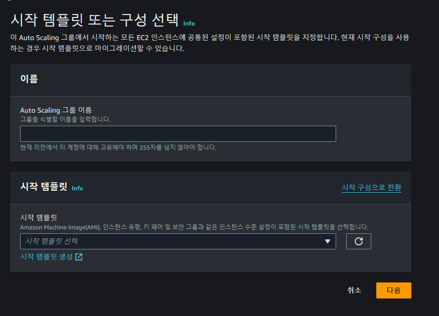
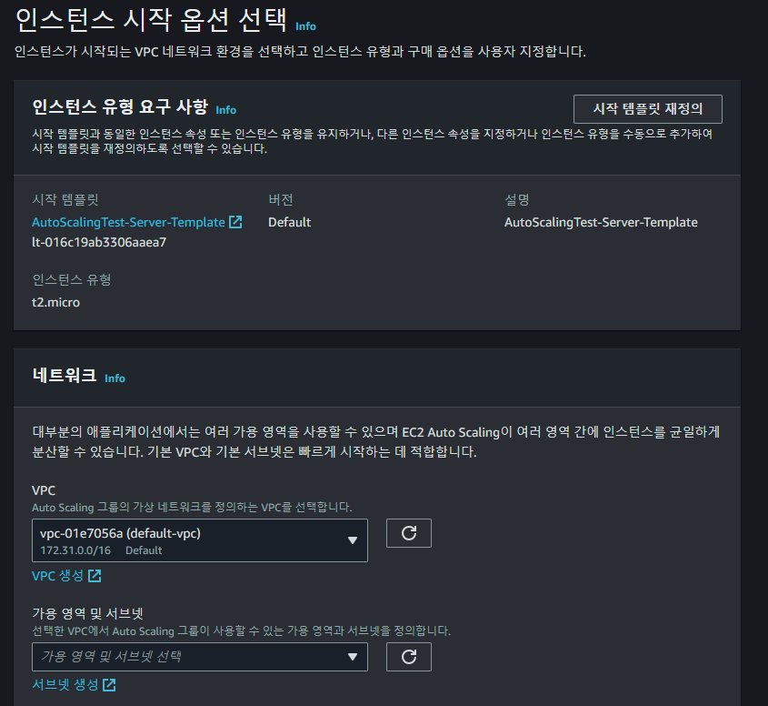

# EC2-AutoScalingGroups
- 오토스케일링그룹(AutoScalingGroup) 생성 과정을 정리합니다.
- ECS에서 클러스터 생성 시점에 생성하는 오토스케일링그룹은 추후 관리 시점에 구분하기 어렵기 때문에 먼저 생성합니다.
 

## Table of Contents
- [생성 과정](#생성-과정)

 

## 생성 과정
- EC2 -> Auto Scaling 그룹(Auto Scaling Groups) -> Auto Scaling 그룹 생성(Create Auto Scaling group)

### 1단계. 시작 탬플릿 또는 구성 선택
- 오토스케일링 그룹 이름을 지정합니다.
- [EC2-LaunchTemplates - Auto Scaling용 시작템플릿 생성](./04-EC2-LaunchTemplates.md/#auto-scaling용-시작템플릿-생성)에서 생성한 템플릿 선택 및 템플릿의 버전을 선택합니다.
 

  
 

### 2단게. 인스턴스 시작 옵션 선택
- 선택한 템플릿 재정의 가능합니다. (인스턴스 유형, 사용자 데이터, 등)
- 사용하려는 VPC 및 VPC의 서브넷을 선택합니다.
 

  
 

### 3단계. 고급 옵션 구성
- 해당 오토스케일링 그룹에 로드밸런서를 연결 할 수 있습니다. (특별히 필요하지 않으면 ECS에서 연결합니다.)
- EC2의 상태를 확인하기위한 설정
- 모니터링으로 CloudWatch 설정

### 4단계. 그룹 크기 및 크기 조정 구성
- 그룹 크기는 유지할 EC2 수
- 크기 조정은 최소, 최대 EC2 수
- 크지 조정 정책, 인스턴스 유지 관리 정책, 보호 설정

### 5단계. 알림 추가
- 인스턴스 시작/종료시 SNS(Amazon Simple Notification Service)로 알림 전송 설정

### 6단계. 태그 추가
- 사용하려는 태그 추가 합니다.
- 현재 설정에서는 Key는 "Name"으로 설정하고 값을 "사용 서비스-오토스케일링그룹이름" 형태로 태그를 추가하여 EC2 목록에서 구분하기 쉽게 설정합니다.

### 7단계. 검토
- 설정한 사항들을 검토하는 단계입니다. 이상이 없다면 오토스케일링 그룹을 생성합니다.

