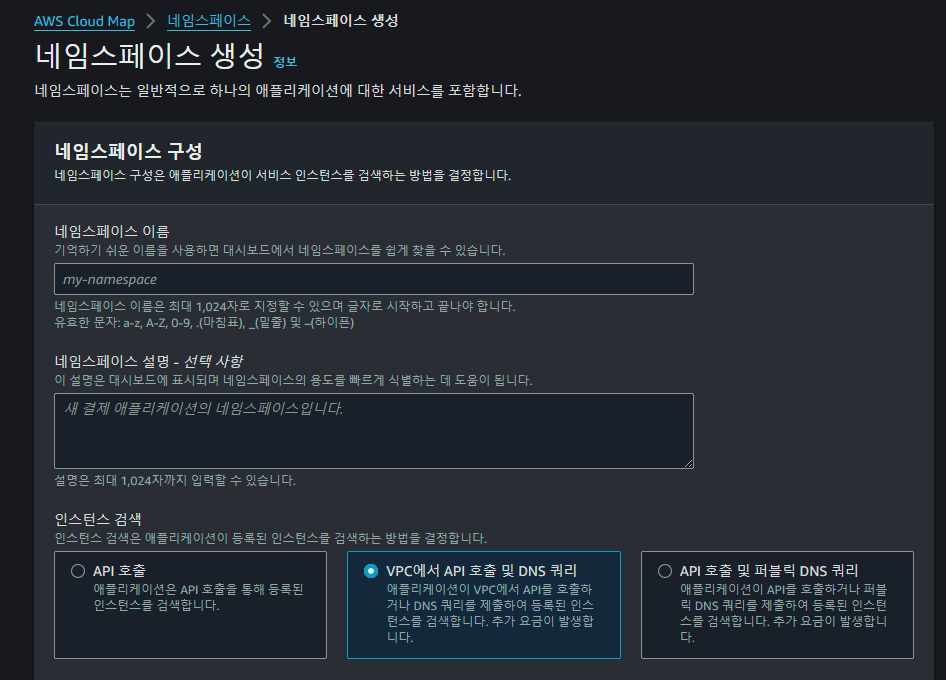
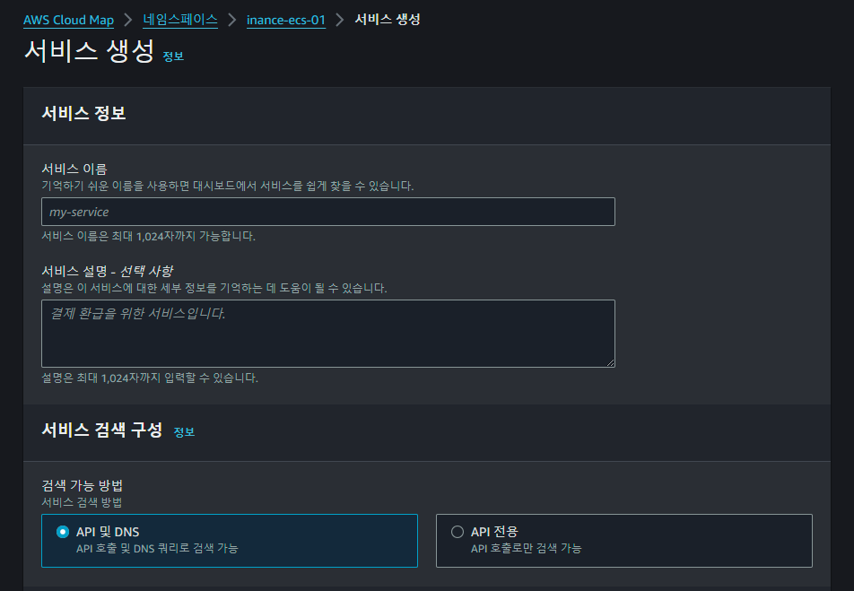
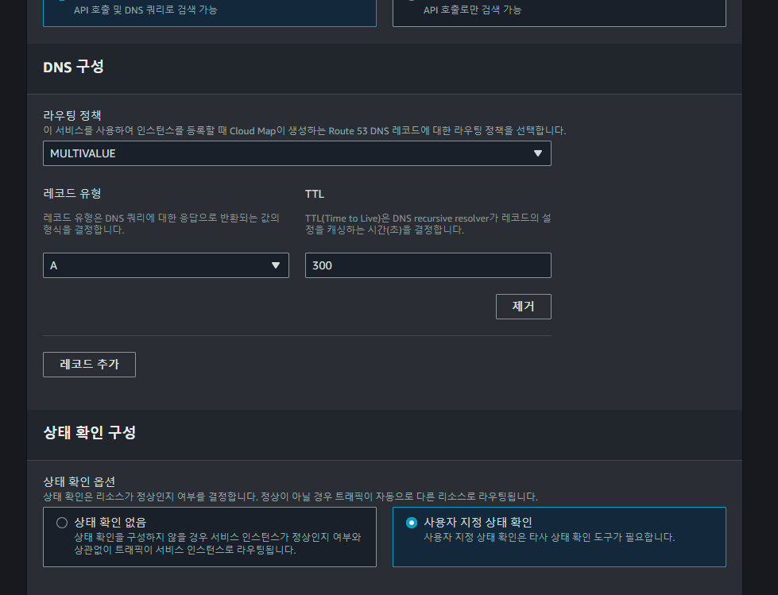

# ECS-ServiceDiscovery
- ECS에서 서비스검색(ServiceDiscovery) 기능을 사용하기 위해 설정하는 과정을 정리하였습니다.
 

## Table of Contents
- [AWS Cloud Map 에서 네임스페이스 생성](#aws-cloud-map-에서-네임스페이스-생성)
- [네임스페이스에 서비스 생성](#네임스페이스에-서비스-생성)
 

## AWS Cloud Map 에서 네임스페이스 생성
- 네임스페이스 이름 작성
- VPC 선택 및 인스턴스 검색에서 "VPC에서 API 호출 및 DNS 쿼리" 선택

 

## 네임스페이스에 서비스 생성
- ECS의 클러스터 내에서 서비스 생성 과정에서 "서비스 검색(ServiceDiscovery)"을 사용하기 위해 네임스페이스에 서비스를 생성 합니다.
- 서비스 검색 구성에서 "API 및 DNS" 선택
- DNS 구성에서 필요에 따라 라우팅 정책 변경하고 나머지는 기본값 사용
- 상태 확인 옵션을 선택

 